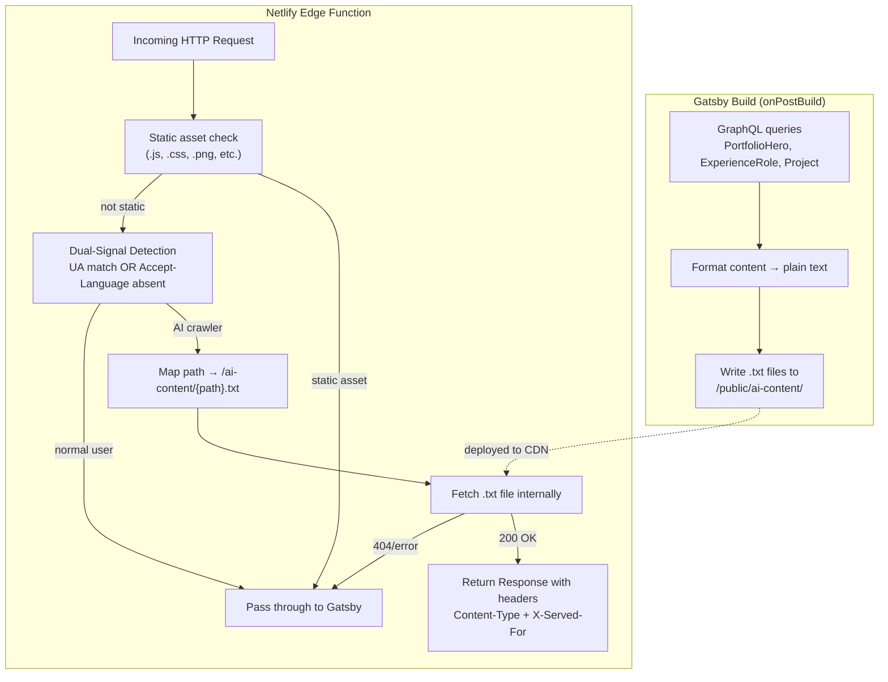

# Design Document

## Overview

This design adds Generative Engine Optimization (GEO) to the portfolio site by serving AI crawlers structured plain-text content instead of the JS-heavy Gatsby output. The system has two parts:

1. **Build-time text generation** — An `onPostBuild` hook in `gatsby-node.ts` queries Contentful via Gatsby's GraphQL layer and writes `.txt` files to `/public/ai-content/`.
2. **Edge-level request rewriting** — A Netlify Edge Function intercepts incoming requests, applies dual-signal detection (User-Agent matching + Accept-Language header absence), and rewrites AI crawler requests to serve the corresponding `.txt` file.

The architecture is intentionally simple: static text files generated at build time, served via edge rewrite. No runtime CMS calls, no additional databases, no new React components.

## Architecture



### Key Design Decisions

**Why `onPostBuild` instead of `onCreatePage`?** The `onPostBuild` hook runs after all pages are built and the `/public` directory is finalized. This guarantees the output directory exists and avoids race conditions with Gatsby's internal file management.

**Why not use `@contentful/rich-text-plain-text-renderer`?** It's not currently installed. Since the `@contentful/rich-text-types` package is already available and the rich text JSON structure is well-defined, a lightweight recursive text extractor (< 15 lines) avoids adding a new dependency for a single use case.

**Why fetch-and-respond instead of returning `new URL()`?** The [Netlify Edge Functions API](https://docs.netlify.com/build/edge-functions/api) confirms that returning a `new URL()` object performs a transparent rewrite (200 status, original URL preserved). However, this approach does not allow setting custom response headers (`Content-Type: text/plain`, `X-Served-For: ai-crawler`). To satisfy Requirements 6.4 and 6.6, the edge function fetches the `.txt` file internally using `new URL()` + `fetch()`, then returns a `new Response()` with the file body and custom headers. If the fetch returns a non-200 status (file doesn't exist), the function falls back to `undefined` (passthrough).

**Why early-exit for static assets?** The edge function runs on `/*`, which includes every `.js`, `.css`, `.png`, font, and image request. Running dual-signal detection on these adds unnecessary latency. A fast path-extension check at the top of the handler returns `undefined` immediately for static assets, keeping asset delivery fast.

**Why dual-signal detection?** UA-only detection misses crawlers that don't identify themselves. The Accept-Language heuristic catches headless HTTP clients that omit browser-standard headers. Combining both signals reduces false negatives while the `triggeredBy` field enables future analysis of which signal is most effective.

## Components and Interfaces

### 1. Text Generator (`gatsby-node.ts` — `onPostBuild`)

Added as a new export alongside the existing `createSchemaCustomization` and `createPages` hooks.

```typescript
// New types for the generator system
interface ContentGenerator {
  name: string;
  generate: (graphql: GatsbyGraphQL) => Promise<string | null>;
}

// Each content type gets a generator function
function generateIndexContent(heroData: PortfolioHeroData): string;
function generateExperienceContent(roles: ExperienceRoleData[]): string;
function generateProjectsContent(projects: ProjectData[]): string;

// Rich text extraction utility
function extractPlainText(rawJson: string): string;

// Orchestrator
export const onPostBuild: GatsbyNode["onPostBuild"] = async ({ graphql }) => {
  // 1. Ensure /public/ai-content/ exists
  // 2. Run each generator
  // 3. Write results to disk, skip on null (missing data)
};
```

The generator pattern is extensible: adding blog post support later means adding a single `generateBlogContent` function and registering it in the generators array.

### 2. Crawler Detector (`netlify/edge-functions/ai-crawler.ts`)

```typescript
// Static asset extensions for early-exit
const STATIC_EXTENSIONS = [
  '.js', '.css', '.png', '.jpg', '.jpeg', '.gif', '.svg',
  '.ico', '.woff', '.woff2', '.ttf', '.eot', '.map',
  '.webp', '.avif', '.json', '.xml', '.webmanifest',
] as const;

// Detection types
type TriggerSignal = 'ua' | 'accept-language' | 'both';

interface DetectionResult {
  isCrawler: boolean;
  triggeredBy: TriggerSignal | null;
}

// Early-exit check (pure, testable)
function isStaticAsset(pathname: string): boolean;

// Core detection function (pure, testable)
function detectAICrawler(userAgent: string | null, acceptLanguage: string | null): DetectionResult;

// Path mapping (pure, testable)
function mapPathToTextFile(pathname: string): string;

// Edge function handler
export default async function handler(
  request: Request,
  context: Context
): Promise<Response | undefined> {
  // 1. Early-exit: skip static assets
  // 2. Run dual-signal detection
  // 3. If not crawler → return undefined (passthrough)
  // 4. Map path to .txt file URL
  // 5. Fetch the .txt file internally
  // 6. If fetch fails (non-200) → return undefined (passthrough)
  // 7. Return new Response with body + custom headers
  //    - Content-Type: text/plain; charset=utf-8
  //    - X-Served-For: ai-crawler
  // TODO: Umami analytics — detection.triggeredBy available here
};

// Inline config
export const config: Config = { path: "/*" };
```

### 3. Netlify Configuration (`netlify.toml`)

```toml
[[edge_functions]]
  function = "ai-crawler"
  path = "/*"
```

Minimal config — just registers the edge function on all paths. The edge function itself handles path filtering and fallback logic.

### 4. Dev Dependencies

`fast-check` is required for property-based testing and must be added as an explicit dev dependency:

```bash
npm install --save-dev fast-check
```

## Data Models

### Contentful Content Types (existing, read-only)

| Content Type | Fields Used | Notes |
|---|---|---|
| `PortfolioHero` | `name`, `subtitle`, `intro.raw` | `intro.raw` is Rich_Text_JSON requiring plain-text extraction |
| `ExperienceRole` | `company`, `title`, `dateRange`, `blurb.blurb`, `technologies`, `tags`, `companyUrl`, `order` | Sorted by `order` ASC |
| `Project` | `name`, `description.description`, `tags`, `githubUrl`, `liveUrl`, `order` | Sorted by `order` ASC |

### Generated Text File Structures

**`/public/ai-content/index.txt`**
```
# {name}
{subtitle}

## About
{intro plain text}
```

**`/public/ai-content/experience.txt`**
```
# Experience

## {title} @ {company}
Date: {dateRange}
{blurb}
Technologies: {tech1}, {tech2}, ...
Tags: {tag1}, {tag2}, ...
URL: {companyUrl}

## {next role...}
```

**`/public/ai-content/projects.txt`**
```
# Projects

## {name}
{description}
Tags: {tag1}, {tag2}, ...
GitHub: {githubUrl}
Live: {liveUrl}

## {next project...}
```

### Detection Result

```typescript
type TriggerSignal = 'ua' | 'accept-language' | 'both';

interface DetectionResult {
  isCrawler: boolean;
  triggeredBy: TriggerSignal | null;
}
```

### AI Crawler UA List

```typescript
const AI_CRAWLER_UAS = [
  'GPTBot', 'ChatGPT-User', 'OAI-SearchBot',
  'Google-Extended', 'Claude-Web', 'ClaudeBot',
  'anthropic-ai', 'Bytespider', 'CCBot',
  'PerplexityBot', 'Amazonbot', 'FacebookBot',
  'Applebot-Extended', 'cohere-ai', 'DiffBot',
] as const;
```

## Correctness Properties

### Property 1: Rich text extraction preserves all text content

*For any* valid Contentful rich text JSON document containing text nodes, the `extractPlainText` function SHALL produce a string that contains every leaf text node value from the document, regardless of nesting depth, node types, or marks applied.

**Validates: Requirements 1.2**

### Property 2: Index content formatter includes all required structural elements

*For any* valid PortfolioHero data (non-empty name, subtitle, and intro text), the `generateIndexContent` function SHALL produce a string that contains the name as a top-level heading, the subtitle, an "About" section label, and the intro text.

**Validates: Requirements 1.4**

### Property 3: Experience content formatter includes all required fields with conditional URL

*For any* non-empty array of ExperienceRole data, the `generateExperienceContent` function SHALL produce a string where each entry contains the title, company, dateRange, blurb text, technologies list, and tags list as labeled fields. Additionally, *for any* entry, the companyUrl SHALL appear in the output if and only if the entry has a non-null companyUrl value.

**Validates: Requirements 2.3, 2.4**

### Property 4: Project content formatter includes all required fields with conditional URL

*For any* non-empty array of Project data, the `generateProjectsContent` function SHALL produce a string where each entry contains the name, description text, tags list, and githubUrl as labeled fields. Additionally, *for any* entry, the liveUrl SHALL appear in the output if and only if the entry has a non-null liveUrl value.

**Validates: Requirements 3.3, 3.4**

### Property 5: Dual-signal detection correctly classifies and reports triggeredBy

*For any* combination of User-Agent string and Accept-Language header value, the `detectAICrawler` function SHALL:
- Return `isCrawler: true` with `triggeredBy: 'ua'` when only the UA matches a known AI crawler identifier (case-insensitive substring match) and Accept-Language is present.
- Return `isCrawler: true` with `triggeredBy: 'accept-language'` when the UA does not match any known identifier and Accept-Language is absent (null).
- Return `isCrawler: true` with `triggeredBy: 'both'` when the UA matches AND Accept-Language is absent.
- Return `isCrawler: false` with `triggeredBy: null` when neither signal triggers.

**Validates: Requirements 5.3, 5.4, 5.5, 5.6, 5.7**

### Property 6: Path mapping produces correct text file paths

*For any* URL pathname, the `mapPathToTextFile` function SHALL produce a path matching the pattern `/ai-content/{normalized-segment}.txt`, where the root path `/` maps to `/ai-content/index.txt` and any other path `/foo` maps to `/ai-content/foo.txt` with leading/trailing slashes stripped.

**Validates: Requirements 6.1, 6.2**

### Property 7: Static asset early-exit correctly identifies static files

*For any* URL pathname ending with a known static file extension (`.js`, `.css`, `.png`, `.jpg`, `.jpeg`, `.gif`, `.svg`, `.ico`, `.woff`, `.woff2`, `.ttf`, `.eot`, `.map`, `.webp`, `.avif`, `.json`, `.xml`, `.webmanifest`), the `isStaticAsset` function SHALL return `true`. *For any* pathname not ending with a known static extension, it SHALL return `false`.

**Validates: Performance optimization for Requirement 6**

## Error Handling

| Scenario | Behavior | Requirement |
|---|---|---|
| PortfolioHero data missing from Contentful | Log warning, skip `index.txt` generation, continue build | 1.5 |
| No ExperienceRole entries in Contentful | Log warning, skip `experience.txt` generation, continue build | 2.5 |
| No Project entries in Contentful | Log warning, skip `projects.txt` generation, continue build | 3.5 |
| `/public/ai-content/` directory missing | Create it with `fs.mkdirSync(path, { recursive: true })` | 4.1, 4.2 |
| `/public/ai-content/` directory already exists | `recursive: true` makes `mkdirSync` a no-op — no error | 4.2 |
| Rich text `intro.raw` is null/undefined | Treat as empty string, still generate file with empty About section | 1.2 |
| Edge function: static asset request | Early-exit returns `undefined` immediately — no detection runs | Performance |
| Edge function: `.txt` file fetch returns non-200 | Return `undefined` to pass through to normal Gatsby response | 6.3 |
| Edge function: request to non-static non-content paths | Detection runs, no `.txt` file exists → fetch fails → passthrough | 6.3 |
| GraphQL query fails during `onPostBuild` | Catch error, log it, skip that generator, continue with others | 8.1 |

All error handling follows the principle: **never fail the build, never break normal users**. Missing content results in skipped text files, not build failures.

## Testing Strategy

### Property-Based Tests

Use `fast-check` (added as explicit dev dependency) as the PBT library.

Each correctness property maps to a single property-based test with a minimum of 100 iterations:

| Property | Test Target | Generator Strategy |
|---|---|---|
| Property 1 | `extractPlainText` | Generate random Contentful rich text JSON trees with varying depth, node types, and text content |
| Property 2 | `generateIndexContent` | Generate random `{ name, subtitle, introText }` objects with arbitrary strings |
| Property 3 | `generateExperienceContent` | Generate random arrays of experience role objects with optional `companyUrl` |
| Property 4 | `generateProjectsContent` | Generate random arrays of project objects with optional `liveUrl` |
| Property 5 | `detectAICrawler` | Generate random `(userAgent, acceptLanguage)` pairs covering all four signal combinations |
| Property 6 | `mapPathToTextFile` | Generate random URL path strings |
| Property 7 | `isStaticAsset` | Generate random pathnames with and without known static extensions |

Tag format: `Feature: ai-crawler-geo, Property {N}: {title}`

### Unit Tests (Example-Based)

- `extractPlainText` with known rich text documents (bold text, nested paragraphs, empty document)
- `mapPathToTextFile('/')` → `/ai-content/index.txt`
- `isStaticAsset('/main.js')` → `true`, `isStaticAsset('/experience')` → `false`
- `detectAICrawler` with specific known crawlers: `"Mozilla/5.0 (compatible; GPTBot/1.0)"` → detected
- Empty data scenarios: null hero data, empty experience array, empty projects array → skip generation
- Edge function response headers: `X-Served-For: ai-crawler` present on rewrites
- Edge function response headers: `Content-Type: text/plain; charset=utf-8` on rewrites

### Integration Tests

- Full `onPostBuild` run with mocked GraphQL returning realistic Contentful data → verify all `.txt` files written
- Edge function handler with mocked fetch → verify rewrite vs passthrough behavior, verify custom headers on rewrite responses

### What's NOT Tested with PBT

- File I/O operations (directory creation, file writing) — tested via integration tests
- Netlify Edge Function wiring (config registration, fetch-based rewrite mechanism) — verified by deployment
- GraphQL query correctness — verified by Gatsby's type generation and integration tests
- Analytics placeholder comments — verified by code review
